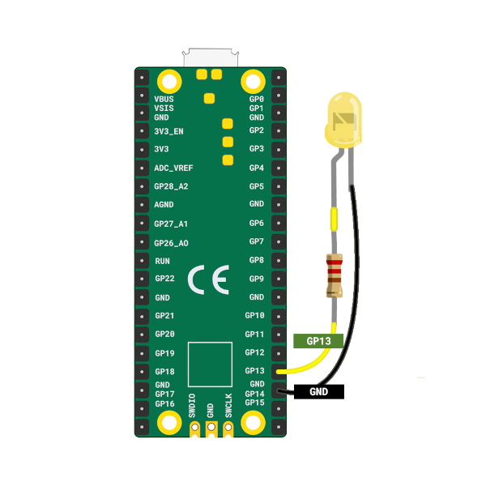

# Blinking an External LED

In this section, we’ll use an external LED to blink.

You'll need some basic electronic components

**Hardware Requirements**
- LED
- Resistor
- Jumper wires

Refer the [Raspberry pi guide](https://projects.raspberrypi.org/en/projects/introduction-to-the-pico/7) for the hardware setup. I actually used it with breadboard instead.

## Components Overview


1. LED: An LED (Light Emitting Diode) lights up when current flows through it. The longer leg (anode) connects to positive, and the shorter leg (cathode) connects to ground. We'll connect the anode to GP13 (with a resistor) and the cathode to GND.

2. Resistors: A resistor limits the current in a circuit to protect components like LEDs. Its value is measured in Ohms (Ω). We'll use a 330 ohm resistor to safely power the LED.

<table>
  <thead>
    <tr>
      <th>Pico Pin</th>
      <th style="width: 250px; margin: 0 auto;">Wire</th>
      <th>Component</th>
    </tr>
  </thead>
  <tbody>
    <tr>
      <td>GPIO 13</td>
      <td style="text-align: center; vertical-align: middle; padding: 0;">
        <div class="wire yellow" style="width: 200px; margin: 0 auto;">
          <div class="female-left"></div>
          <div class="female-right"></div>
        </div>
      </td>
      <td>Resistor</td>
    </tr>
    <tr>
      <td>Resistor</td>
      <td style="text-align: center; vertical-align: middle; padding: 0;">
        <div class="wire orange" style="width: 200px; margin: 0 auto;">
          <div class="female-left"></div>
          <div class="female-right"></div>
        </div>
      </td>
      <td>Anode (long leg) of LED</td>
    </tr>
    <tr>
      <td>GND</td>
      <td style="text-align: center; vertical-align: middle; padding: 0;">
        <div class="wire black" style="width: 200px; margin: 0 auto;">
          <div class="female-left"></div>
          <div class="female-right"></div>
        </div>
      </td>
      <td>Cathode (short leg) of LED</td>
    </tr>
  </tbody>
</table>




## Code
There isn't much change in the code. We showcase how to blink an external LED connected to GPIO 13.  The code uses a push-pull output configuration to control the LED state. By setting the pin high, the LED is turned on, and by setting it low, the LED is turned off. This process is repeated in an infinite loop with a delay of 200 milliseconds between each state change, allowing the LED to blink at a consistent rate. 

```rust
let mut led_pin = pins.gpio13.into_push_pull_output();

loop {
    led_pin.set_high().unwrap();
    delay.delay_ms(200);
    led_pin.set_low().unwrap();
    delay.delay_ms(200);
}
```

## Clone the existing project
You can clone the blinky project I created and navigate to the `external-led` folder to run this version of the blink program:

```sh
git clone https://github.com/ImplFerris/pico2-rp-projects
cd pico2-projects/external-led
```

## How to Run?

You refer the ["Running The Program"](../running.md) section
