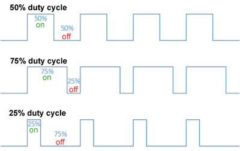
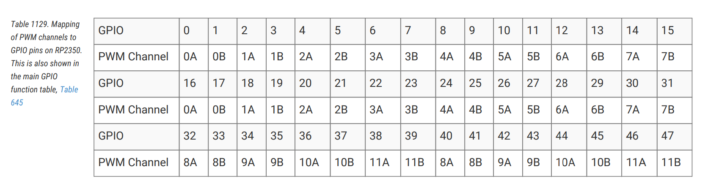

## What is PWM?
PWM stands for **Pulse Width Modulation**. It is a technique used to control the amount of power delivered to a device by adjusting the width of the pulses in a signal.

In PWM, a digital signal switches between **on** and **off** states. The **duty cycle** of the signal determines how long it stays on compared to how long it stays off. 

- **Duty Cycle**: 
The percentage of time the signal is on during one cycle. 

<span style="text-align: center;display: block; margin: auto;  font-size: 12px;">Image Credit: Wikipedia</span>
  - For example:
    - 100% duty cycle means the signal is always on.
    - 50% duty cycle means the signal is on half the time and off half the time.
    - 0% duty cycle means the signal is always off.

Refer the 1073th page of the [RP2350](https://datasheets.raspberrypi.com/rp2350/rp2350-datasheet.pdf) Datasheet for more information.

## PWM Peripheral in RP2350
The PWM peripheral is responsible for generating PWM signals. The Pico 2 features 12 PWM generators, known as slices, with each slice having two channels(A/B). This configuration results in a total of 24 PWM output channels available for use.

**Mapping of PWM channels to GPIO Pins**: 

You can find the table on page 1073 of the [RP2350](https://datasheets.raspberrypi.com/rp2350/rp2350-datasheet.pdf) Datasheet for more information. You have to refer this table when using a specific GPIO, as each GPIO corresponds to a particular slice. For instance, using GP25 (for the LED) means you are working with output 4B, which is the B output of the fourth slice.



Initialize the PWM slices by creating an instance using the PAC's PWM peripheral and reset control.
```rust
let mut pwm_slices = hal::pwm::Slices::new(pac.PWM, &mut pac.RESETS);
```

Retrieve a mutable reference to PWM4 from the initialized PWM slices for further configuration.
```rust
let pwm = &mut pwm_slices.pwm4;
```

Configure PWM4 to operate in phase-correct mode for smoother output transitions.  (You can refer the [secrets arudion PWM](https://docs.arduino.cc/tutorials/generic/secrets-of-arduino-pwm/) if you want to know what is phase-correct)
```rust
pwm.set_ph_correct();
```

Get a mutable reference to channel B of PWM4 and direct its output to GPIO pin 25.
```rust
let channel = &mut pwm.channel_b;
channel.output_to(pins.gpio25);
```

## Fading Effect

For LED brightness, PWM works by rapidly turning the LED on and off. If this happens fast enough, our eyes perceive a steady light, and the brightness increases with a higher duty cycle.


In the previous example code, we use PWM to fade an LED.

### Fading Up
The code below gradually increases the LED brightness by adjusting the duty cycle from 0 to 25,000, with a small delay between each step:
```rust
for i in LOW..=HIGH {
  delay.delay_us(8);
  let _ = channel.set_duty_cycle(i);
}
```
The delay ensures the LED brightens gradually. Without it, the brightness would change too quickly for the eye to notice, making the LED appear to jump from dim to bright. The delay allows for a smooth, noticeable "fading up" effect.  

Dont' believe me! Adjust the delay to 0 and observe. You can increase the delay (eg: 25) and observe the fading effect.

Note: `set_duty_cycle` function under the hood writes the given value into CC register(Count compare value). 

### Fading Down
The following code decreases the LED brightness by reducing the duty cycle from 25,000 to 0.
```rust
// Here rev is to reverse the iteration. so it goes from 25_000 to 0
for i in (LOW..=HIGH).rev() {  
    delay.delay_us(8);
    let _ = channel.set_duty_cycle(i);
}
```

### Pause
After fading up and down, the program pauses for 500 milliseconds before repeating the cycle, allowing the LED to rest briefly.

Play around by adjusting the `delay` and observe. You can even comment out one of the for loop and observe the effect. 

