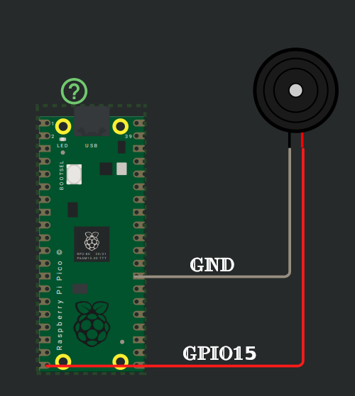

# Buzzinga

In this section, we'll explore some fun activities using the `buzzer`. I chose the title "Buzzinga" just for fun (a nod to Sheldon's "Bazinga" in *The Big Bang Theory*); it’s not a technical term.

- **Passive Buzzer**
- **Jumper Wires**:
  - **Female-to-Male** jumper wires for connecting the Pico 2 to the buzzer pins (Positive and Ground).

The buzzer has two pins:  
| Pin       | Function   | Description                                |
|-----------|------------|--------------------------------------------|
| Positive  | Signal     | Connects to GPIO15 on the Pico 2 to control the buzzer. |
| Ground    | Ground (GND) | Connects to any ground pin on the Pico 2.         |

The positive side of the buzzer is typically marked with a **+** symbol and is the longer pin, while the negative side (ground) is the shorter pin, similar to an LED. However, some passive buzzers may allow for either pin to be connected to ground or signal, depending on the specific model. 

By the way, I used an active buzzer in my experiment. A passive buzzer is recommended if you plan to play different sounds, as it provides a better tone.

## Connection Overview
1. **Signal (Positive)**: Connect the buzzer's positive pin to **GPIO15** on the Pico 2. This pin will receive PWM signals to produce different sounds based on the signal's frequency.
2. **Ground (GND)**: Connect the buzzer's ground pin to any ground pin on the Pico 2.

Before moving forward, make sure you've read the following sections and understood the concepts.
- [PWM introduction](../blinky/pwm.md) in the Blink LED section
- [More on PWM](../servo/pwm.md) in the servo section
- [Calculating top](../servo/servo-pico.md) in the servo section

## Reference
- [Pico official guide on buzzer](https://projects.raspberrypi.org/en/projects/introduction-to-the-pico/9)
