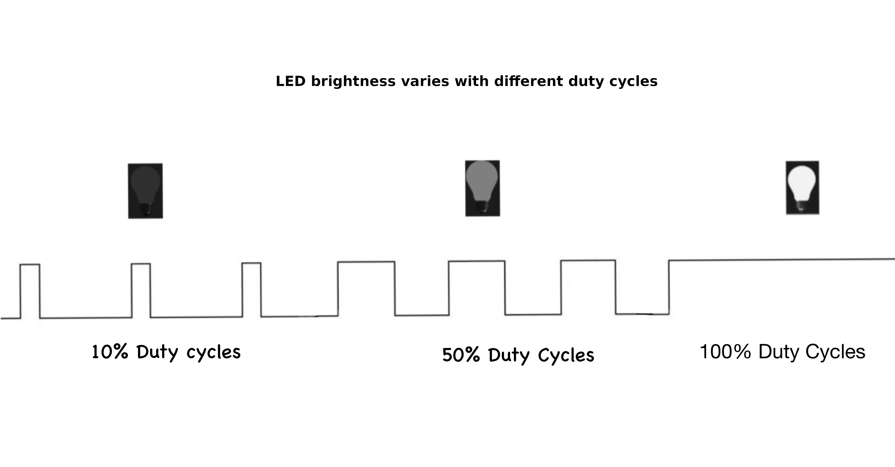

# Pulse Width Modulation (PWM)

In this section, we will explore what is PWM and why we need it.

## Digital vs Analog
In a digital circuit, signals are either high (such as 5V or 3.3V) or low (0V), with no in-between values. These two distinct states make digital signals ideal for computers and digital devices, as they're easy to store, read, and transmit without losing accuracy.   

Analog signals, however, can vary continuously within a range, allowing for any value between a High and Low voltage.  This smooth variation is valuable for applications requiring fine control, such as adjusting audio volume or light brightness.

Devices like servo motors and LEDs(for dimming effect) often need gradual, precise control over voltage, which analog signals provide through their continuous range.

Microcontrollers use PWM to bridge this gap.

## What is PWM?
PWM stands for **Pulse Width Modulation**, creates an analog-like signal by rapidly pulsing a digital signal on and off. The average output voltage, controlled by adjusting the pulse's high duration or "duty cycle," can simulate a continuous analog level. 
 
 

## Duty Cycle

The **duty cycle** is the percentage of time a signal is "on" during one complete cycle. 

For example:
- 100% duty cycle means the signal is always on.
- 50% duty cycle means the signal is on half the time and off half the time.
- 0% duty cycle means the signal is always off.

Here is the interactive simulation. Use the sliders to adjust the duty cycle and frequency, and watch how the pulse width and LED brightness change.  The upper part of the square wave represents when the signal is high (on). The lower part represents when the signal is low(off)

<canvas id="pwmCanvas" width="800" height="200"></canvas>

  

  

  

  <label for="dutyCycle">Duty Cycle (%): </label>
  <input type="range" id="dutyCycle" min="0" max="100" value="50">
  50%

  <label for="frequency">Frequency (Hz): </label>
  <input type="range" id="frequency" min="1" max="50" value="10">
  <!-- x Hz -->

If you change the duty cycle from "low to high" and "high to low" in the simulation, you should notice the LED kind of giving a dimming effect.

## Period and Frequency
Period is the total time for one on-off cycle to complete. 

The frequency of a PWM signal is the number of cycles it completes in one second, measured in Hertz (Hz).  Frequency is the inverse of the period.  So, a higher frequency means a shorter period, resulting in faster switching between HIGH and LOW states.

\\[
\text{Frequency (Hz)} = \\frac{1}{\text{Period (s)}}
\\]

So if the period is 1 second, then the frequency will be 1HZ.

\\[
1 \text{Hz} = \\frac{1 \text{ cycle}}{1 \text{ second}} = \\frac{1}{1 \text{ s}}
\\]

For example, if the period is 20ms(0.02s), the frequency will be 50Hz.

\\[
\text{Frequency} = \\frac{1}{20 \text{ ms}} = \\frac{1}{0.02 \text{ s}} = 50 \text{ Hz}
\\]

**Calculating Cycle count from Frequency per second**

The Formula to calculate cycle count:  
\\[
\text{Cycle Count} = \text{Frequency (Hz)} \\times \text{Total Time (seconds)}
\\]

If a PWM signal has a frequency of 50Hz, it means it completes 50 cycles in one second.

