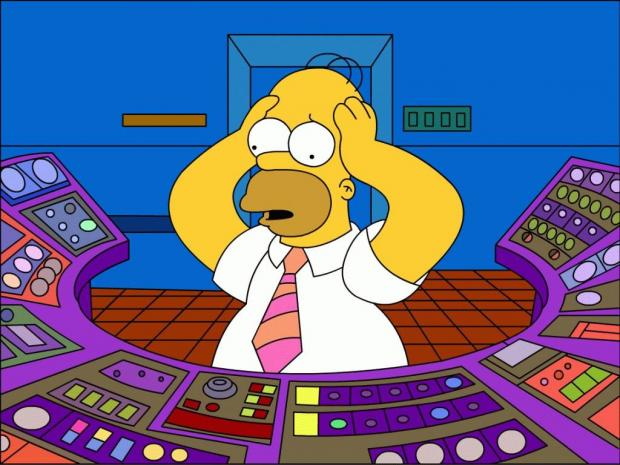
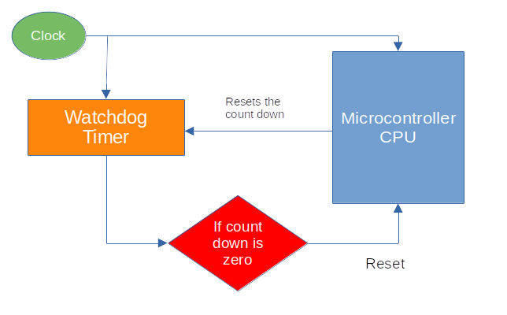

# Watchdog

This book was originally written using `rp-hal`. Later, I revised it to primarily use Embassy. When working with `rp-hal`, there is a step where we explicitly configure the watchdog. To explain why that line exists and what it actually does, this chapter introduces the concept of a watchdog.

In January 1994, the Clementine spacecraft successfully mapped the Moon. While it was traveling toward the asteroid Geographos, a floating point exception occurred on May 7, 1994, in the Honeywell 1750 processor. This processor handled telemetry and several other critical spacecraft functions.



The Honeywell 1750 included a built-in watchdog timer, but it was not used. After the failure, the software team publicly regretted this decision. They also noted that even a standard watchdog might not have been robust enough to detect that specific failure mode.

So what exactly is a watchdog, and why do we use it?

You may already have a rough idea.

## What is watchdog?

A watchdog timer (WDT) is a hardware component commonly found in embedded systems. Its primary job is to detect software failures and automatically reset the processor when something goes wrong. This allows the system to recover without human intervention.

Watchdogs are especially important in systems that must run unattended for long periods of time.

## How It Works?

A watchdog timer behaves like a countdown timer. It starts counting down from a configured value toward zero. The software must periodically reset this timer before it reaches zero.

This action is commonly called "feeding the watchdog". You may also see it referred to as "kicking the dog", although that term is widely used and I personally avoid it.

If the software fails to reset the timer in time, for example due to an infinite loop, a deadlock, or a system hang, the watchdog assumes the system is no longer healthy and triggers a processor reset. After the reset, the system can start again in a known good state.

**Feeding the dog:**

You can think of the watchdog timer like a dog that needs to be fed at regular intervals. As time passes, the dog gets hungrier. If it is not fed in time, it reacts. In embedded systems, that reaction is a hardware reset.

To keep the system running normally, the software must regularly feed the watchdog by resetting its counter.



## Code

In the following snippet, we set up the watchdog driver. This is required because the clock initialization code depends on the watchdog being available.

```rust
// Set up the watchdog driver - needed by the clock setup code
let mut watchdog = hal::Watchdog::new(pac.WATCHDOG);
```

## References
- [Great Watchdog Timers For Embedded Systems, by Jack Ganssle](https://www.ganssle.com/watchdogs.pdf)
- [Born to fail](https://www.embedded.com/born-to-fail/)
- [A Guide to Watchdog Timers for Embedded Systems](https://interrupt.memfault.com/blog/firmware-watchdog-best-practices)
- [Proper Watchdog Timer Use](https://betterembsw.blogspot.com/2014/05/proper-watchdog-timer-use.html)
