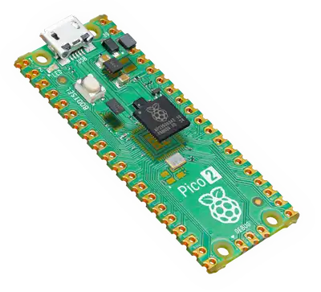

# Pico Pico - Intro

In this book, we use the Raspberry Pi Pico 2 and program it in Rust to explore various exciting projects. You'll work on exercises like dimming an LED, controlling a servo motor, measuring distance with an ultrasonic sensor, displaying the Ferris (🦀) image on an OLED display, using an RFID reader, playing songs on a buzzer, turning on an LED when the room light is off, measuring temperature, and much more.

## Meet the hardware - Pico 2

We will be using the Raspberry Pi Pico 2, which is based on the new RP2350 chip. It offers dual-core flexibility with support for ARM Cortex-M33 cores and optional Hazard3 RISC-V cores. By default, it operates using the standard ARM cores, but developers can choose to experiment with the RISC-V architecture if needed.

You find more details from the [official website](https://www.raspberrypi.com/products/raspberry-pi-pico-2/).

There is also a variant called the Pico 2 W, which includes Wi-Fi and Bluetooth connectivity.

> **NOTE**: There is an older Raspberry Pi Pico that uses the RP2040 chip. In this book, we will be using the newer **Pico 2** with the **RP2350** chip. When buying hardware, make sure to get the correct one!

## Datasheets

For detailed technical information, specifications, and guidelines, refer to the official datasheets:

- [Pico 2 Datasheet](https://datasheets.raspberrypi.com/pico/pico-2-datasheet.pdf)
- [RP2350 chip Datasheet](https://datasheets.raspberrypi.com/rp2350/rp2350-datasheet.pdf)

## License

The Pico Pico book(this project) is distributed under the following licenses:

* The code samples and free-standing Cargo projects contained within this book are licensed under the terms of both the [MIT License] and the [Apache License v2.0].
* The written prose contained within this book is licensed under the terms of the Creative Commons [CC-BY-SA v4.0] license.

[MIT License]: https://opensource.org/licenses/MIT
[Apache License v2.0]: http://www.apache.org/licenses/LICENSE-2.0
[CC-BY-SA v4.0]: https://creativecommons.org/licenses/by-sa/4.0/legalcode

## Support this project

You can support this book by starring this project on [GitHub](https://github.com/ImplFerris/pico-pico) or sharing this book with others 😊

### Disclaimer:

The experiments and projects shared in this book have worked for me, but results may vary. I'm not responsible for any issues or damage that may occur while you're experimenting. Please proceed with caution and take necessary safety precautions.
