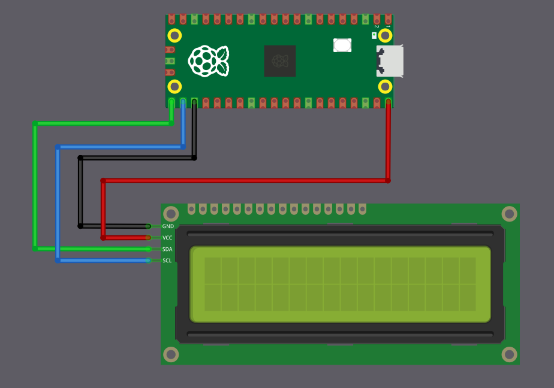

# Connecting LCD Display (LCD1602) to the Raspberry Pi Pico

We will connect the LCD1602 with an I2C adapter to the Raspberry Pi Pico using the default I2C pins.  Only four connections are required: power, ground, SDA, and SCL.

<table>
  <thead>
    <tr>
      <th style="width: 250px;">LCD Pin</th>
      <th style="width: 250px; text-align: center;">Wire</th>
      <th>Pico Pin</th>
      <th>Notes</th>
    </tr>
  </thead>
  <tbody>
    <tr>
      <td>GND</td>
      <td style="text-align: center; vertical-align: middle; padding: 0;">
        

          

          

        

      </td>
      <td>GND</td>
      <td>Common ground</td>
    </tr>
    <tr>
      <td>VCC</td>
      <td style="text-align: center; vertical-align: middle; padding: 0;">
        

          

          

        

      </td>
      <td>VBUS</td>
      <td>5V power supply for the LCD</td>
    </tr>
    <tr>
      <td>SCL</td>
      <td style="text-align: center; vertical-align: middle; padding: 0;">
        

          

          

        

      </td>
      <td>GPIO 17</td>
      <td>I2C clock line (I2C0 SCL)</td>
    </tr>
    <tr>
      <td>SDA</td>
      <td style="text-align: center; vertical-align: middle; padding: 0;">
        

          

          

        

      </td>
      <td>GPIO 16</td>
      <td>I2C data line (I2C0 SDA)</td>
    </tr>
  </tbody>
</table>

 

