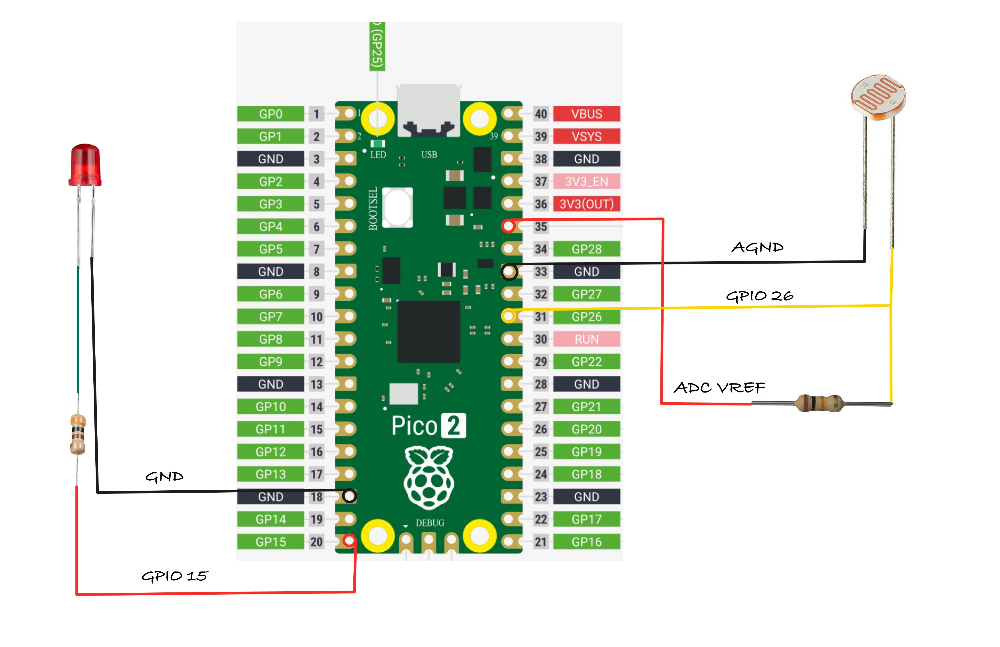

## Setup

## Hardware Requirements

- **LED** – Any standard LED (choose your preferred color).
- **LDR (Light Dependent Resistor)** – Used to detect light intensity.
- **Resistors**
  - **300Ω** – For the LED to limit current and prevent damage. (You might have to choose based on your LED)
  - **10kΩ** – For the LDR, forming a voltage divider in the circuit. (You might have to choose based on your LDR)
- **Jumper Wires** – For connecting components on a breadboard or microcontroller.

## Circuit to connect LED, LDR with Pico 

### LDR (Light Dependent Resistor) Setup:
1. **One side of the LDR** is connected to **AGND** (Analog Ground).
2. The **other side of the LDR** is connected to **GPIO26 (ADC0)**, which is the analog input pin of the pico2
3. A **resistor** is placed between the LDR and **ADC_VREF** (the reference voltage for the analog-to-digital converter).
    - From the datasheet: "ADC_VREF is the ADC power supply (and reference) voltage, and is generated on Pico 2 by filtering the 3.3V supply. This pin can be used with an external reference if better ADC performance is required"
