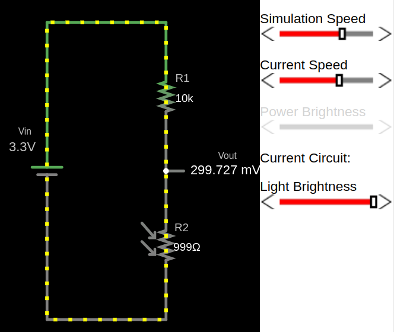
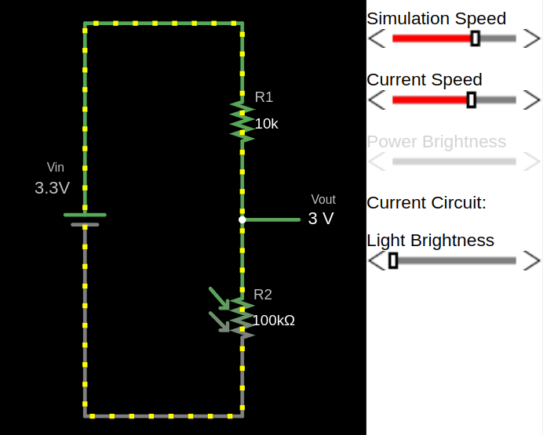

## LDR

We have already given an introduction to what an LDR is. Let me repeat it again: an LDR changes its resistance based on the amount of light falling on it. The brighter the light, the lower the resistance, and the dimmer the light, the higher the resistance.

**Dracula**: Imagine the LDR like Dracula. In bright light, its power (resistance) decreases. In the dark, it becomes stronger (higher resistance). 

## Circuit

I have created a voltage divider circuit with an LDR(a resistor symbol with arrows, kind of indicating light shining on it) in Falstad . You can import the circuit file I created, [`voltage-divider-ldr.circuitjs.txt`](./voltage-divider-ldr.circuitjs.txt), import into the [Falstad site](https://www.falstad.com/circuit/e-voltdivide.html) and play around.

You can adjust the brightness value and observe how the resistance of R2 (which is the LDR) changes. Also, you can watch how the \\( V_{out} \\) voltage changes as you increase or decrease the brightness.

### Example output for full brightness
The resistance of the LDR is low when exposed to full brightness, causing the output voltage(\\( V_{out} \\)) to be significantly lower.

### Example output for low light
With less light, the resistance of the LDR increases and the output voltage increase.

### Example output for full darkness
In darkness, the LDR's resistance is high, resulting in a higher output voltage (\\( V_{out} \\)).

## Reference:
- [Analogue to Digital Converter](https://www.electronics-tutorials.ws/combination/analogue-to-digital-converter.html)
