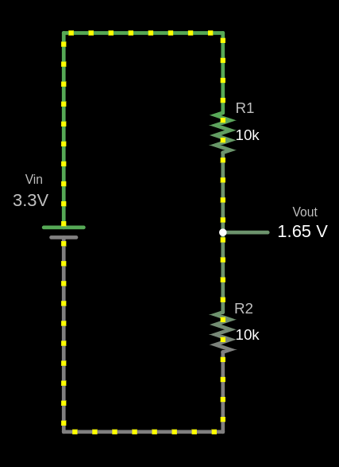

# Voltage Divider

A **voltage divider** is a simple circuit that reduces an input voltage \\( V_{in} \\) to a lower output voltage \\( V_{out} \\) using two series resistors. The resistor connected to the input voltage \\( V_{in} \\) is called \\( R_{1} \\), and the other resistor is \\( R_{2} \\). The output voltage \\( V_{out} \\) is taken from the junction between \\( R_{1} \\) and \\( R_{2} \\), producing a fraction of \\( V_{in} \\).

## Circuit



The output voltage (V<sub>out</sub>) is calculated using this formula:

\\[
V_{out} = V_{in} \times \frac{R_2}{R_1 + R_2}
\\]

### Example Calculation for \\( V_{out} \\)

Given:
- \\( V_{in} = 3.3V \\)
- \\( R_1 = 10 k\Omega \\)
- \\( R_2 = 10 k\Omega \\)

Using the voltage divider formula:

\\[
V_{out} = V_{in} \times \frac{R_2}{R_1 + R_2}
\\]

Substitute the values:

\\[
V_{out} = 3.3V \times \frac{10 k\Omega}{10 k\Omega + 10 k\Omega} = 3.3V \times \frac{10}{20} = 3.3V \times 0.5 = 1.65V
\\]


The output voltage \\( V_{out} \\) is 1.65V.


```rust,editable
fn main() {
    // You can edit the code
    // You can modify values and run the code 
    let vin: f64 = 3.3;
    let r1: f64 = 10000.0;
    let r2: f64 = 10000.0;

    let vout = vin * (r2 / (r1 + r2));

    println!("The output voltage Vout is: {:.2} V", vout);
}
```

## Use cases

Voltage dividers are used in applications like potentiometers, where the resistance changes as the knob is rotated, adjusting the output voltage. They are also used to measure resistive sensors such as light sensors and thermistors, where a known voltage is applied, and the microcontroller reads the voltage at the center node to determine sensor values like temperature.


## Simulator

I used the website [https://www.falstad.com/circuit/e-voltdivide.html](https://www.falstad.com/circuit/e-voltdivide.html) to create this diagram. It's a great tool for drawing circuits. You can download the file I created, [`voltage-divider.circuitjs.txt`](./voltage-divider.circuitjs.txt), and import it to experiment with the circuit.
