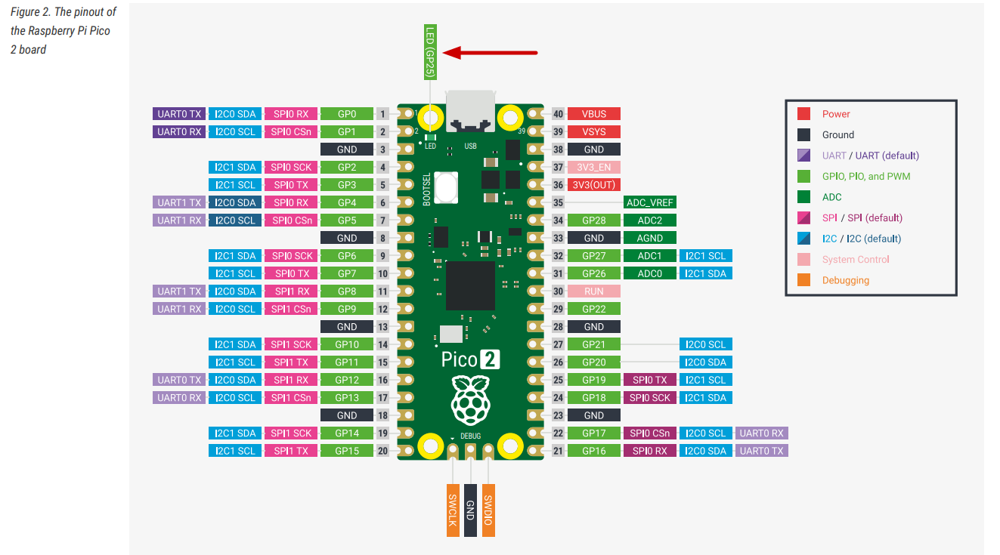

# Dimming LED

In this section, we will learn how to create a dimming effect(i.e. reducing and increasing the brightness) for an LED using the Raspberry Pi Pico 2. First, we will dim the onboard LED, which is connected to GPIO pin 25 (based on the datasheet). 

To make it dim, we use a technique called PWM (Pulse Width Modulation). You can refer to the intro to the PWM section [here](../core-concepts/pwm/index.md).

We will gradually increment the PWM's duty cycle to increase the brightness, then we gradually decrement the PWM duty cycle to  reduce the brightness of the LED. This effectively creates the dimming LED effect. 

