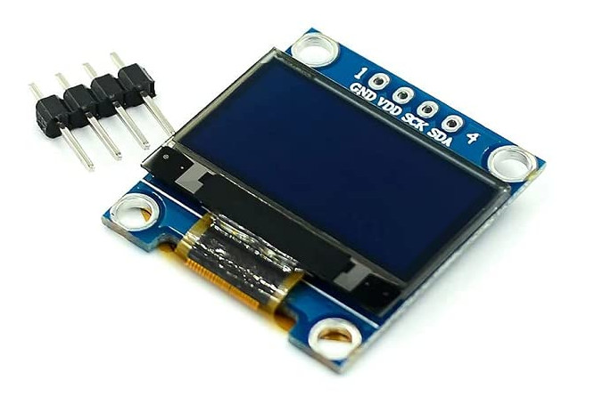
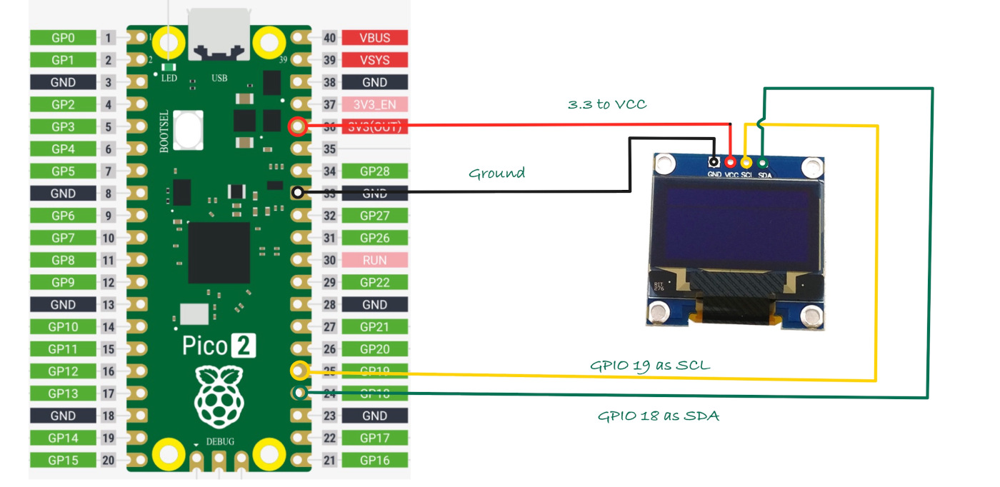

## OLED Display

In this section, we'll learn how to connect an OLED display module to the Raspberry Pi Pico 2.

We'll create simple projects like displaying text and an image (display Ferris 🦀 image) on the OLED. We'll use the I2C protocol to connect the OLED display to the Pico.

### Hardware Requirements

For this project, you'll need:
- An OLED display (0.96 Inch I2C/IIC 4-Pin, 128x64 resolution, SSD1306 chip)
- A breadboard
- Jumper wires

## Setup
We will connect the SDA to GPIO 18 and the SCL to GPIO 19. Attach VCC to 3.3V for power, and GND to GND. This setup allows the OLED display to communicate with the microcontroller using I2C.

## New crates
In addition to the usual crate like `rp-hal`, we will be using these new crates necessary for the project.

- [`ssd1306`](https://github.com/rust-embedded-community/ssd1306): a driver for the SSD1306 OLED display, supporting both I2C and 4-wire SPI.
- [`embedded-graphics`](https://github.com/embedded-graphics/embedded-graphics): a 2D graphics library tailored for memory-constrained embedded devices, enabling text and graphic rendering.
- [`tinybmp`](https://github.com/embedded-graphics/tinybmp): a lightweight BMP parser for embedded, no-std environments. We'll use this to directly load `.bmp` images with the `embedded-graphics` crate, avoiding the need for raw image data.

