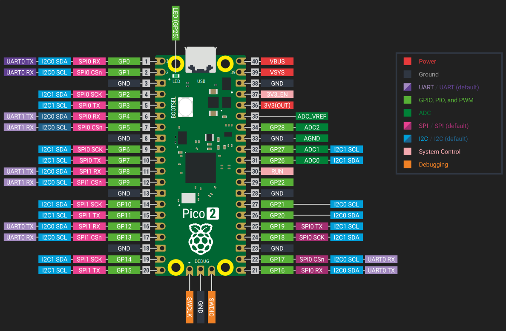
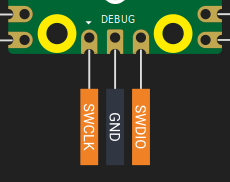

# Raspberry Pi Pico 2 Pinout Diagram

> **Note:** You don't need to memorize or understand every pin right now. We will refer back to this section as needed while working through the exercises in this book.

## Power Pins

The Raspberry Pi Pico 2 has several power pins. These are marked in red (power) and black (ground) in the pinout diagrams. These pins are used to supply power to the board and to external components.

- **VBUS** is connected to the 5V coming from the USB port. When the board is powered over USB, this pin will carry about 5V. You can use it to power small external circuits, but it's not suitable for high-current loads.

- **VSYS** is the main power input for the board. You can connect a battery or regulated supply here with a voltage between 1.8V and 5.5V. This pin powers the onboard 3.3V regulator, which supplies the RP2350 and other parts.

- **3V3(OUT)** provides a stable 3.3V output from the onboard regulator. It can be used to power external components like sensors or displays, but it's best to limit the current draw to under 300mA.

- **GND** pins are used to complete electrical circuits and are connected to the system ground. The Pico 2 provides multiple GND pins spread across the board for convenience when connecting external devices.

## GPIO Pins

The Raspberry Pi Pico 2 includes 26 General Purpose Input/Output (GPIO) pins, labeled GPIO0 through GPIO29, though not all numbers are exposed on the headers. These GPIOs are highly flexible and can be used to read inputs like switches or sensors, or to control outputs such as LEDs, motors, or other devices.

All GPIOs operate at 3.3V logic. This means any input signal you connect should not exceed 3.3 volts, or you risk damaging the board. While many GPIOs support basic digital I/O, some also support additional functions like analog input (ADC), or act as communication lines for protocols like I2C, SPI, or UART.

### Pin Numbering
Each GPIO number is an internal label used in software, and it maps to a physical pin on the board. When connecting external hardware, it is important to use a pinout diagram to match the GPIO number with its corresponding physical pin. For instance, GPIO0 is located on physical pin 1. 

> GPIO25 is special, it is connected to the onboard LED and can be controlled directly in code without any external wiring.

## ADC Pins

Most of the pins on the Raspberry Pi Pico 2 are digital - they can only read or send values like ON (high) or OFF (low). But some devices, like light sensors or temperature sensors, produce signals that change gradually. To understand these kinds of signals, we need special pins called ADC pins.

**ADC** stands for **Analog-to-Digital Converter**. It takes a voltage and turns it into a number your program can understand. For example, a voltage of 0V might become 0, and 3.3V might become 4095 (the highest number the ADC can produce, since it uses 12-bit resolution). We will take a closer look at the ADC later in this book.

The Raspberry Pi Pico 2 has three ADC-capable pins. These are GPIO26, GPIO27, and GPIO28, which correspond to ADC0, ADC1, and ADC2 respectively. You can use these pins to read analog signals from sensors such as light sensors, temperature sensors.

There are also two special pins that support analog readings:

- **ADC_VREF** is the reference voltage for the ADC. By default, it's connected to 3.3V, meaning the ADC will convert anything between 0V and 3.3V into a number. But you can supply a different voltage here (like 1.25V) if you want more precise measurements in a smaller range.

- **AGND** is the analog ground, used to provide a clean ground for analog signals. This helps reduce noise and makes your analog readings more accurate. If you're using an analog sensor, it's a good idea to connect its ground to AGND instead of a regular GND pin.
 
## I2C Pins

The Raspberry Pi Pico 2 supports I2C, a communication protocol used to connect multiple devices using just two wires. It is commonly used with sensors, displays, and other peripherals.

I2C uses two signals: **SDA** (data line) and **SCL** (clock line). These two lines are shared by all connected devices. Each device on the bus has a unique address, so the Pico 2 can talk to many devices over the same pair of wires.

The Raspberry Pi Pico 2 has two I2C controllers: I2C0 and I2C1. Each controller can be mapped to multiple GPIO pins, giving you flexibility depending on your circuit needs.

- **I2C0** can use these GPIOs:
  - SDA (data): GPIO0, GPIO4, GPIO8, GPIO12, GPIO16, or GPIO20
  - SCL (clock): GPIO1, GPIO5, GPIO9, GPIO13, GPIO17, or GPIO21

- **I2C1** can use these GPIOs:
  - SDA (data): GPIO2, GPIO6, GPIO10, GPIO14, GPIO18, or GPIO26
  - SCL (clock): GPIO3, GPIO7, GPIO11, GPIO15, GPIO19, or GPIO27

You can choose any matching SDA and SCL pair from the same controller (I2C0 or I2C1).

## SPI Pins

SPI (Serial Peripheral Interface) is another communication protocol used to connect devices like displays, SD cards, and sensors. Unlike I2C, SPI uses more wires but offers faster communication. It works with one controller (like the Pico 2) and one or more devices.

SPI uses four main signals:

- **SCK** (Serial Clock): Controls the timing of data transfer.
- **MOSI** (Master Out Slave In): Data sent from the controller to the device.
- **MISO** (Master In Slave Out): Data sent from the device to the controller.
- **CS/SS** (Chip Select or Slave Select): Used by the controller to select which device to talk to.

On Pico 2 pinout diagrams, MOSI is labeled as **Tx**, MISO as **Rx**, and CS as **Csn**.

The Raspberry Pi Pico 2 has two SPI controllers: SPI0 and SPI1. Each can be connected to multiple GPIO pins, so you can choose whichever set fits your circuit layout.

- **SPI0** can use:
  - SCK: GPIO2, GPIO6, GPIO10, GPIO14, GPIO18
  - MOSI: GPIO3, GPIO7, GPIO11, GPIO15, GPIO19
  - MISO: GPIO0, GPIO4, GPIO8, GPIO12, GPIO16

- **SPI1** can use:
  - SCK: GPIO14, GPIO18
  - MOSI: GPIO15, GPIO19
  - MISO: GPIO8, GPIO12, GPIO16

You can choose a group of compatible pins from the same controller depending on your circuit layout. The CS (chip select) pin is not fixed-you can use any free GPIO for that purpose. We will explore how to configure SPI and connect devices in upcoming chapters.

## UART Pins

UART (Universal Asynchronous Receiver/Transmitter) is one of the simplest ways for two devices to talk to each other. It uses just two main wires:

- **TX** (Transmit): Sends data out.
- **RX** (Receive): Receives data in.

UART is often used to connect to serial devices like GPS modules, Bluetooth adapters, or even to your computer for debugging messages.

The Raspberry Pi Pico 2 has two UART controllers: **UART0** and **UART1**. Each one can be mapped to several different GPIO pins, giving you flexibility when wiring your circuit.

- **UART0** can use:
  - TX: GPIO0, GPIO12, GPIO16
  - RX: GPIO1, GPIO13, GPIO17

- **UART1** can use:
  - TX: GPIO4, GPIO8
  - RX: GPIO5, GPIO9

You need to use a matching TX and RX pin from the same UART controller. For example, you could use UART0 with TX on GPIO0 and RX on GPIO1, or UART1 with TX on GPIO8 and RX on GPIO9.

## SWD Debugging Pins

The Raspberry Pi Pico 2 provides a dedicated 3-pin debug header for SWD (Serial Wire Debug), which is the standard ARM debugging interface. SWD allows you to flash firmware, inspect registers, set breakpoints, and perform real-time debugging.

This interface consists of the following signals:
- **SWDIO** – Serial data line
- **SWCLK** – Serial clock line
- **GND** – Ground reference

These pins are not shared with general-purpose GPIO and are located on a separate debug header at the bottom edge of the board. You will typically use an external debug probe like the Raspberry Pi Debug Probe, CMSIS-DAP adapter, or other compatible tools (e.g., OpenOCD, probe-rs) to connect to these pins.

## Onboard Temperature Sensor

The Raspberry Pi Pico 2 includes a built-in temperature sensor that is connected internally to **ADC4**. This means you can read the chip's temperature using the ADC, just like you would with an external analog sensor.

This sensor measures the temperature of the RP2350 chip itself. It does not reflect the room temperature accurately, especially if the chip is under load and heating up.

## Control Pins

These pins control the board's power behavior and can be used to reset or shut down the chip.

- **3V3(EN)** is the enable pin for the onboard 3.3V regulator. Pulling this pin low will disable the 3.3V power rail and effectively turn off the RP2350.

- **RUN** is the reset pin for the RP2350. It has an internal pull-up resistor and stays high by default. Pulling it low will reset the microcontroller. This is helpful if you want to add a physical reset button or trigger a reset from another device.
