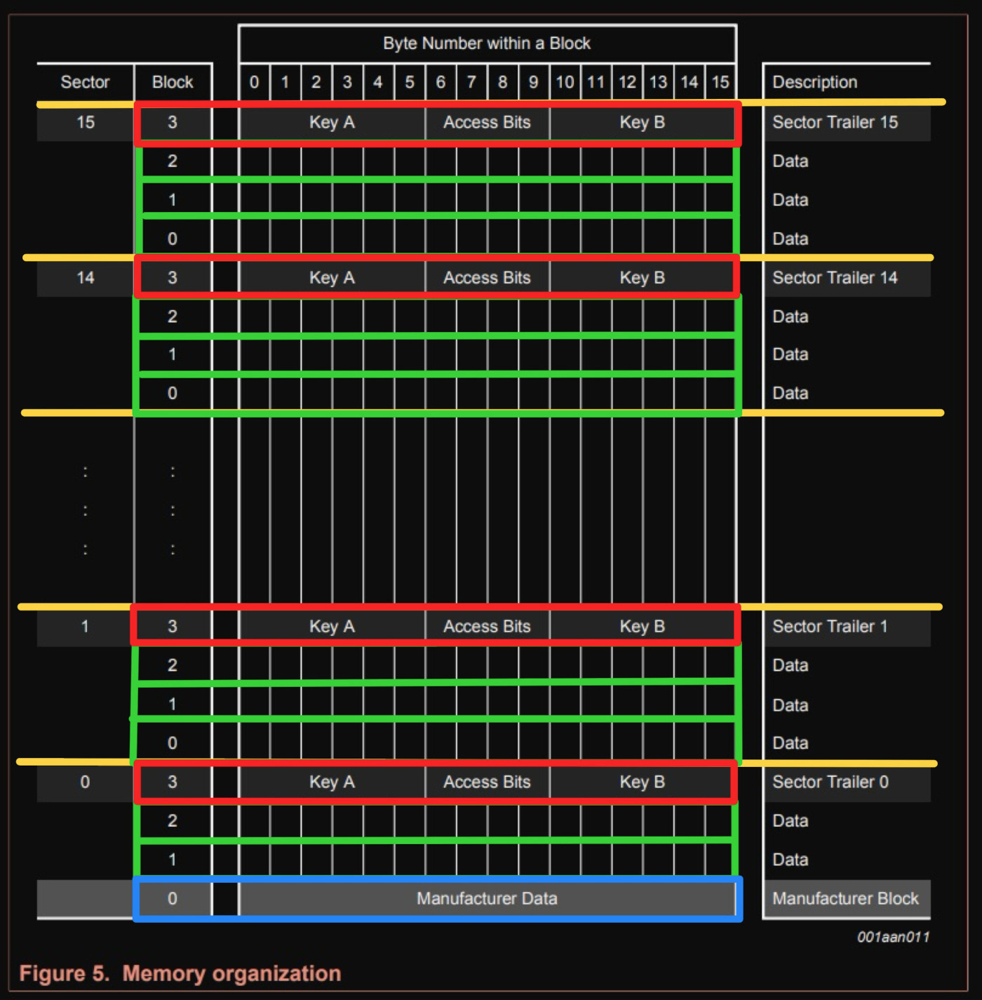

## MIFARE
MIFARE is a series of integrated circuit (IC) chips used in contactless smart cards and proximity cards, developed by NXP Semiconductors. MIFARE cards follow ISO/IEC 14443A standards and use encryption methods such as Crypto-1 algorithm. The most common family is MIFARE Classic, with a subtype called [MIFARE Classic EV1](https://www.nxp.com/products/rfid-nfc/mifare-hf/mifare-classic/mifare-classic-ev1-1k-4k:MF1S50YYX_V1).

### Memory Layout
The MIFARE Classic 1K card is divided into 16 sectors, with each sector containing 4 blocks. Each block can hold up to 16 bytes, resulting in a total memory capacity of 1KB.

16 sectors × 4 blocks/sector × 16 bytes/block = 1024 bytes = 1KB

**Sector Trailer:**

The last block of each sector, known as the "trailer" holds two secret keys and programmable access conditions for the blocks within that sector. Each sector has its own pair of keys (KeyA and KeyB), enabling support for multiple applications with a key hierarchy.

  ℹ️ The MIFARE Classic 1K card is pre-configured with the default key FF FF FF FF FF FF for both KeyA and KeyB.  When reading the trailer block, KeyA values are returned as all zeros (00 00 00 00 00 00), while KeyB returned as it is.

 By default, the access bytes (6, 7, and 8 of the trailer) are set to FF 07 80h. You can refer the 10th page for the [datasheet](https://www.nxp.com/docs/en/data-sheet/MF1S50YYX_V1.pdf) for more information.

**Manufacturer Block:** 

The first block (block 0) of the first sector(sector 0) contains IC manufacturer's data including the UID. This block is write-protected.  

**Data Block:**

Each sector has a trailer block, so only 3 blocks can be used for data storage in each sector. However, the first sector only has 2 usable blocks because the first block stores manufacturer data.

To read or write the data, you first need to authenticate with either Key A or Key B of that sector. Refer to the datasheet for more information. 

## Reference
- Datasheet: [MIFARE Classic EV1 1K - Mainstream contactless smart card IC for fast and easy solution development](https://www.nxp.com/docs/en/data-sheet/MF1S50YYX_V1.pdf)
