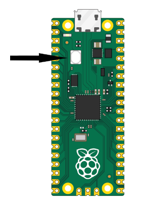

# Running the program
Before we explore further examples, let’s cover the general steps to build and run any program on the Raspberry Pi Pico 2.


## Build and Run for ARM
```sh
# build the program
cargo build --target=thumbv8m.main-none-eabihf
```

To Flash your application onto the Pico 2, press and hold the BOOTSEL button. While holding it, connect the Pico 2 to your computer using a micro USB cable. You can release the button once the USB is plugged in.



```sh
# Run the program
cargo run --target=thumbv8m.main-none-eabihf
```
**Note:** The example codes include a runner configuration in the `.cargo/config.toml` file, defined as:  
`runner = "picotool load -u -v -x -t elf"`.  This means that when you execute `cargo run`, it actually invokes the `picotool` with the `load` subcommand to flash the program.


## Build and Run for RISC-V
```sh
# build the program
cargo build --target=riscv32imac-unknown-none-elf
```

Follow the same BOOTSEL steps as described above.
```sh
# Run the program
cargo run --target=riscv32imac-unknown-none-elf
```
