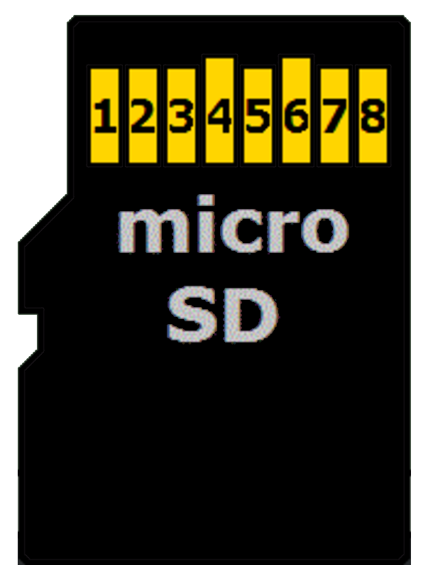
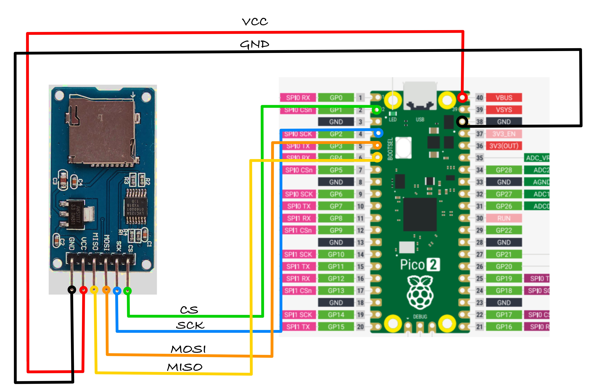

# Connecting Micro SD Card Reader with Raspberry Pi Pico

In this section, we are going to wire a microSD card reader module to the Raspberry Pi Pico using SPI mode.

## microSD Card Pin Mapping for SPI Mode

We will focus only on the microSD card itself, since that is what we are using. A microSD card has 8 physical pins, but in SPI mode only 6 of them are actually required.

You may have noticed that most microSD card reader modules also expose only 6 pins. That is because those modules are already wired internally for SPI operation, and the unused pins are simply not brought out.

The table below shows how the microSD card pins map to SPI signals.

  
  <table>
    <thead>
      <tr>
        <th>microSD Card Pin</th>
        <th>SPI Function</th>
      </tr>
    </thead>
    <tbody>
      <tr>
        <td>1</td>
        <td>-</td>
      </tr>
      <tr>
        <td>2</td>
        <td>Chip Select (CS); also referred as Card Select</td>
      </tr>
      <tr>
        <td>3</td>
        <td>Data Input (DI) - corresponds to MOSI. To receive data from the microcontroller.</td>
      </tr>
      <tr>
        <td>4</td>
        <td>VDD - Power supply (3.3V)</td>
      </tr>
      <tr>
        <td>5</td>
        <td>Serial Clock (SCK)</td>
      </tr>
      <tr>
        <td>6</td>
        <td>Ground (GND)</td>
      </tr>
      <tr>
        <td>7</td>
        <td>Data Output (DO) - corresponds to MISO. To send data from the microSD card to the microcontroller.</td>
      </tr>
      <tr>
        <td>8</td>
        <td>-</td>
      </tr>
    </tbody>
  </table>

## Connecting the Raspberry Pi Pico to the SD Card Reader

Before connecting your SD card module, check its datasheet or product specifications for the input voltage requirements. SD card modules have different voltage requirements depending on their design.

Verify that your module supports 3.3V input before connecting it to the Pico's 3V3(OUT) pin.

If your module requires a higher voltage than 3.3V, you will need additional level shifting circuitry to protect the Pico's GPIO pins. The Raspberry Pi Pico's GPIO pins are not 5V tolerant and can be permanently damaged by 5V signals on the data lines.

### Wiring Diagram

<table>
  <thead>
    <tr>
      <th>Pico Pin</th>
      <th style="width: 250px; margin: 0 auto;">Wire</th>
      <th>SD Card Pin</th>
    </tr>
  </thead>
  <tbody>
    <tr>
      <td>GPIO 1</td>
      <td style="text-align: center; vertical-align: middle; padding: 0;">
        

          

          

        

      </td>
      <td>CS</td>
    </tr>
    <tr>
      <td>GPIO 2</td>
      <td style="text-align: center; vertical-align: middle; padding: 0;">
        

          

          

        

      </td>
      <td>SCK</td>
    </tr>
    <tr>
      <td>GPIO 3</td>
      <td style="text-align: center; vertical-align: middle; padding: 0;">
        

          

          

        

      </td>
      <td>MOSI</td>
    </tr>
    <tr>
      <td>GPIO 4</td>
      <td style="text-align: center; vertical-align: middle; padding: 0;">
        

          

          

        

      </td>
      <td>MISO</td>
    </tr>
        <tr>
      <td>3.3V</td>
      <td style="text-align: center; vertical-align: middle; padding: 0;">
        

          

          

        

      </td>
      <td>VCC</td>
    </tr>
    <tr>
      <td>GND</td>
      <td style="text-align: center; vertical-align: middle; padding: 0;">
        

          

          

        

      </td>
      <td>GND</td>
    </tr>
  </tbody>
</table>
 

