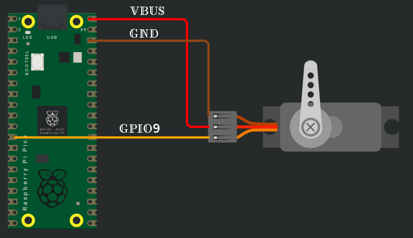

# Servo Motor and PWM

In this section, we'll connect an SG90 Micro Servo Motor to the Pico 2 and control its rotation using PWM. The servo will move in a loop, rotating from 0 degrees to 90 degrees, and then to 180 degrees.

Before moving forward, make sure you've read the [PWM introduction](../blinky/pwm.md) in the Blink LED section.

## Hardware Requirements
- **SG90 Micro Servo Motor**
- **Jumper Wires**:
  - **Female-to-Male** jumper wires for connecting the Pico 2 to the servo motor pins (Ground, Power, and Signal).

The SG90 servo has three wires: 
| Wire Color | Function       | Description                                   |
|------------|----------------|-----------------------------------------------|
| Red        | Power (5V)     | Supplies 5V power to the servo.               |
| Brown      | Ground (GND)   | Connects to ground.                           |
| Orange     | Signal (PWM)   | Receives PWM signal to control the servo's position. |

## Connection Overview
1. **Ground (GND)**: Connect the servo's GND pin (typically the **brown** wire, though it may vary) to any ground pin on the Pico 2.
2. **Power (VCC)**: Connect the servo's VCC pin (usually the **red** wire) to the Pico 2's 5V (or 3.3V if required by your setup) power pin.
3. **Signal (PWM)**: Connect the servo's control (signal) pin to **GPIO9** on the Pico 2, configured for PWM. This is commonly the **orange** wire (may vary).

