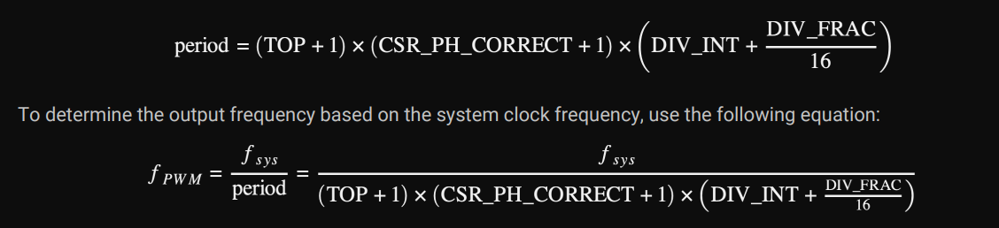
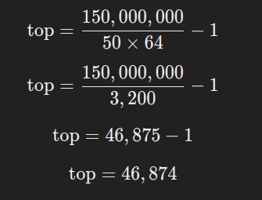

## Servo and Pico

To control a servo with the Raspberry Pi Pico, we need to set a 50Hz PWM frequency. Currently, RP-HAL doesn't allow directly setting the frequency, so we achieve this by adjusting the `top` and `div_int` values.

Refer the 1073th page of the [RP2350](https://datasheets.raspberrypi.com/rp2350/rp2350-datasheet.pdf) Datasheet to understand how `top` and `div_int` works.

### Formula from datasheet
The following formula from the datasheet is used to calculate the period and determine the output frequency based on the system clock frequency.

  

For the pico2, the system clock frequency (f_sys) is 150MHZ.

### Let's calculate `top`
We want the PWM frequency (f_pwm) to be 50 Hz. In order to achieve that, we are going to adjust the `top` and `div_int` values.

The top value must be within the range of 0 to 65535 (since it's a 16-bit unsigned integer). To make sure the top value fits within this range, I chose values for the divisor (div_int) in powers of 2 (such as 8, 16, 32, 64), though this isn't strictly necessary (it's just a preference). In this case, we chose `div_int = 64` to calculate a top value that fits within the u16 range.

With the chosen div_int and system parameters, we can calculate the top using the following formula:
 

After performing the calculation, we find that the top value is `46,874`.

You can experiment with different div_int and corresponding top values. Just ensure that div_int stays within the u8 range, top fits within the u16 range, and the formula yields a 50Hz frequency.

(In case you are wondering, we are not setting the `div_frac` which is 0 by default. That's why it is not included in the calculation.)


### Position calculation based on top
To calculate the duty cycle that corresponds to specific positions (0, 90, and 180 degrees), we use the following formula based on the top value:

```rust
const PWM_DIV_INT: u8 = 64;
const PWM_TOP: u16 = 46_874;

const TOP: u16 = PWM_TOP + 1;
const MIN_DUTY: u16 = (TOP as f64 * (2.5 / 100.)) as u16;
const HALF_DUTY: u16 = (TOP as f64 * (7.5 / 100.)) as u16;
const MAX_DUTY: u16 = (TOP as f64 * (12. / 100.)) as u16;
```

We multiply the TOP value by a duty cycle percentage to determine the appropriate pulse width for each position of the servo.

