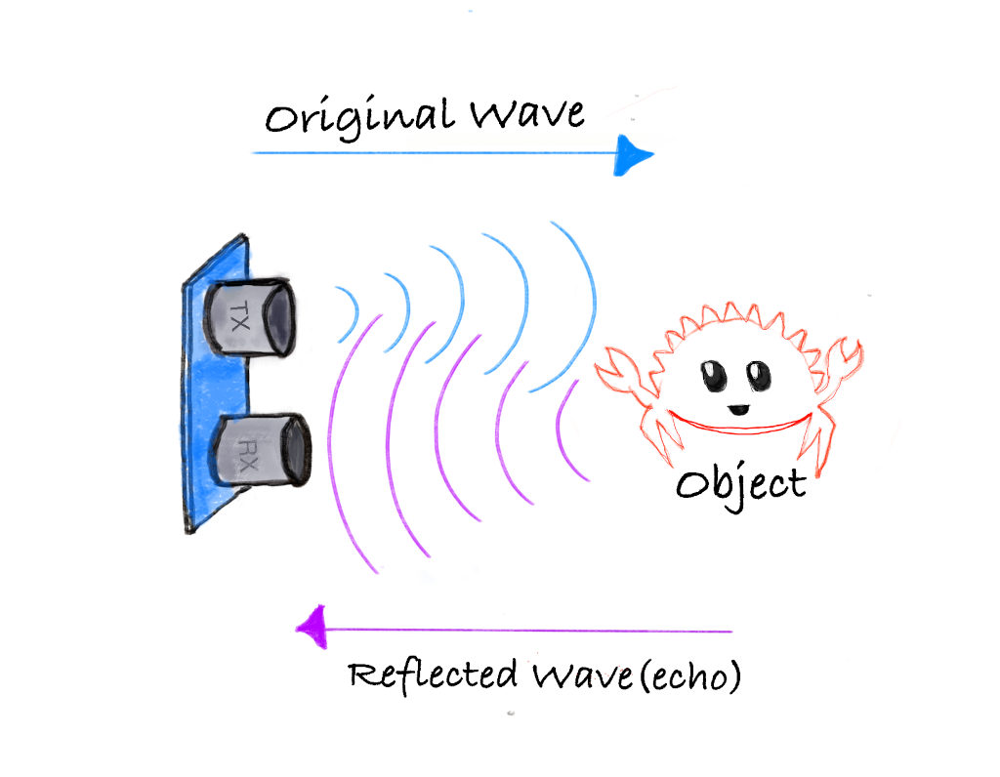

# How Does an Ultrasonic Sensor Work?

Ultrasonic sensors work by emitting sound waves at a frequency too high for humans to hear. These sound waves travel through the air and bounce back when they hit an object. The sensor calculates the distance by measuring how long it takes for the sound waves to return.



- **Transmitter:** Sends out ultrasonic sound waves.
- **Receiver:** Detects the sound waves that bounce back from an object.

**Formula to calculate distance**: 
```
Distance = (Time x Speed of Sound) / 2
```

The speed of sound is approximately 0.0343 cm/µs (or 343 m/s) at normal air pressure and a temperature of 20°C.

## Example Calculation:

Let’s say the ultrasonic sensor detects that the sound wave took 2000 µs to return after hitting an object.

Step 1: Calculate the total distance traveled by the sound wave:
```
Total distance = Time x Speed of Sound
Total distance = 2000 µs x 0343 cm/µs = 68.6 cm
```

Step 2: Since the sound wave traveled to the object and back, the distance to the object is half of the total distance:
```
Distance to object = 68.6 cm / 2 = 34.3 cm
```

Thus, the object is 34.3 cm away from the sensor.

 