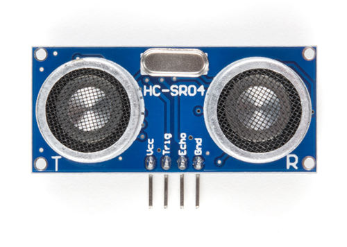

# Ultrasonic

In this guide, we'll learn how to use the HC-SR04 ultrasonic sensor with the Raspberry Pi Pico 2. Ultrasonic sensors measure distances by emitting ultrasonic sound waves and calculating the time taken for them to return after bouncing off an object.  

These kind of sensors you can normally find in the car parking assistance; When you reverse the car for parking, the sensor measures the distance between objects and alert you as you get close to it.
 
We will build a simple project that gradually increases the LED brightness using PWM, when the ultrasonic sensor detects an object distance of less than 30 cm  - You can adjust this value as per your needs.

## Prerequisites

Before starting, get familiar with yourself on these topics

- [PWM](../core-concepts/pwm/index.md)

## 🛠 Hardware Requirements
To complete this project, you will need:

- HC-SR04 Ultrasonic Sensor
- Breadboard
- Jumper wires
- External LED (You can also use the onboard LED, but you'll need to modify the code accordingly)

The HC-SR04 Sensor module has a transmitter and receiver. The module has Trigger and Echo pins which can be connected to the GPIO pins of a pico. When the receiver detects the returning sound wave, the Echo pin goes HIGH for a duration equal to the time it takes for the wave to return to the sensor.
