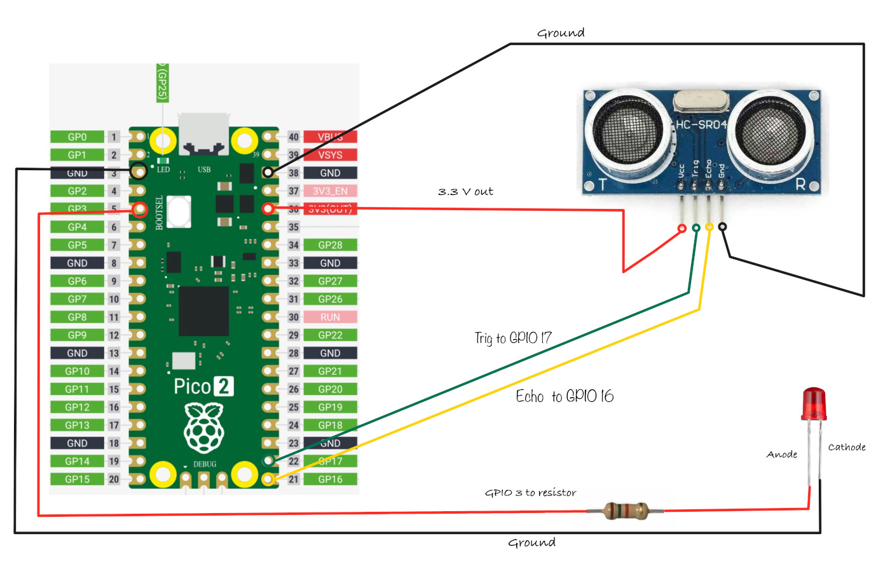

# Ultrasonic

In this section, we'll learn how to interface the HC-SR04 ultrasonic sensor with a Raspberry Pi Pico 2. Ultrasonic sensors measure distances by emitting ultrasonic sound waves and calculating the time taken for them to return after bouncing off an object.
 
 We will build a simple project that gradually increases the LED brightness using PWM, when the ultrasonic sensor detects an object distance of less than 30 cm.

## 🛠 Hardware Requirements
To complete this project, you will need:

- HC-SR04 Ultrasonic Sensor
- Breadboard
- Jumper wires
- External LED (You can also use the onboard LED, but you'll need to modify the code accordingly)

The HC-SR04 Sensor module has a transmitter and receiver. The module has Trigger and Echo pins which can be connected to the GPIO pins of a pico and other microcontrollers. When the receiver detects the returning sound wave, the Echo pin goes high for a duration equal to the time it takes for the wave to return to the sensor.

## Setup

Connection for the Pico and Ultrasonic:
<table>
  <thead>
    <tr>
      <th>Pico Pin</th>
      <th style="height: 4px; width: 250px; margin: 0 auto;">Wire</th>
      <th>HC-SR04 Pin</th>
    </tr>
  </thead>
  <tbody>
    <tr>
      <td>3.3V</td>
      <td style="text-align: center; vertical-align: middle; padding: 0;">
        

          

          

        

      </td>
      <td>VCC</td>
    </tr>
    <tr>
      <td>GPIO 17</td>
      <td style="text-align: center; vertical-align: middle; padding: 0;">
        

          

          

        

      </td>
      <td>Trig</td>
    </tr>
    <tr>
      <td>GPIO 16</td>
      <td style="text-align: center; vertical-align: middle; padding: 0;">
        

          

          

        

      </td>
      <td>Echo</td>
    </tr>
    <tr>
      <td>GND</td>
      <td style="text-align: center; vertical-align: middle; padding: 0;">
        

          

          

        

      </td>
      <td>GND</td>
    </tr>
  </tbody>
</table>

- **VCC**: Connect the VCC pin on the HC-SR04 to the 3.3V pin on the Pico. 
    - Although the HC-SR04 generally operates at 5V, using 3.3V helps protect the Pico, as its GPIO pins are rated for 3.3V. There is some unconfirmed information that the Pico 2 GPIO might tolerate 5V, but for now, this is uncertain. 
    - I’ve tested both 3.3V and 5V connections without issues so far 🤞. (If anyone has confirmed details on this, please raise an issue so we can keep this guide accurate.)
    - Other considerations: Alternatively, you can use HCSR04+ (which can operate at both 3.3v and 5V) or use logic level shifter.
- **Trig**: Connect to GPIO 17 on the Pico to start the ultrasonic sound pulses.
- **Echo**: Connect to GPIO 16 on the Pico; this pin sends a pulse when it detects the reflected signal, and the pulse length shows how long the signal took to return.
- **GND**: Connect to the ground pin on the Pico.
- **LED**: Connect the anode (long leg) of the LED to GPIO 3, as in the [External LED setup](../blinky/external-led.md).

Connection for the Pico and LED:

<table>
  <thead>
    <tr>
      <th>Pico Pin</th>
      <th style="width: 250px; margin: 0 auto;">Wire</th>
      <th>Component</th>
    </tr>
  </thead>
  <tbody>
    <tr>
      <td>GPIO 3</td>
      <td style="text-align: center; vertical-align: middle; padding: 0;">
        

          

          

        

      </td>
      <td>Resistor</td>
    </tr>
    <tr>
      <td>Resistor</td>
      <td style="text-align: center; vertical-align: middle; padding: 0;">
        

          

          

        

      </td>
      <td>Anode (long leg) of LED</td>
    </tr>
    <tr>
      <td>GND</td>
      <td style="text-align: center; vertical-align: middle; padding: 0;">
        

          

          

        

      </td>
      <td>Cathode (short leg) of LED</td>
    </tr>
  </tbody>
</table>

