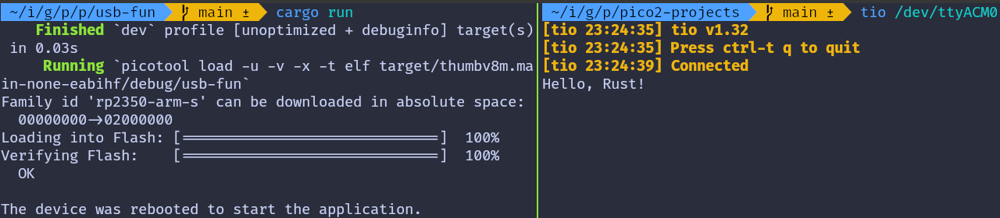

# USB Serial Example Using rp-hal

We are going to use an [example](https://github.com/rp-rs/rp-hal/blob/main/rp235x-hal-examples/src/bin/usb.rs) provided in the RP HAL repository and make a few small changes to it so we can clearly see two way communication working.

The original example sends a simple "Hello, World!" message from the Pico to the computer once the internal timer reaches a certain count. It also polls for incoming data from the computer and sends data back. 

We'll slightly modify the code to make it more fun. Instead of sending "Hello, World!", we'll send "Hello, Rust!" to the computer. Wait, I know that's not the fun part. Here it comes: if you type 'r' in the terminal connected via USB serial, the onboard LED will turn on. Type anything else, and the LED will turn off.

## Project from template

To set up the project, generate it from the provided template:

```sh
cargo generate --git https://github.com/ImplFerris/pico2-template.git --tag v0.3.2
```
When prompted, give your project a name, like "usb-serial-led" and select `RP-HAL` as the HAL.


### Additional Crates required

Update your Cargo.toml to add the following crates along with the existing dependencies:

```rust
usbd-serial = "0.2.2"
usb-device = "0.3.2"
```

### Additional imports

```rust
// USB Device support
use usb_device::{class_prelude::*, prelude::*};

// USB Communications Class Device support
use usbd_serial::SerialPort;

// For the LED
use embedded_hal::digital::OutputPin;
```

## LED Setup

We will configure the onboard LED.

```rust
let mut led = pins.gpio25.into_push_pull_output();
```

## Set up the USB driver

We first create the USB bus using the RP2350 USB peripheral and its DPRAM:

```rust
let usb_bus = UsbBusAllocator::new(hal::usb::UsbBus::new(
    pac.USB,
    pac.USB_DPRAM,
    clocks.usb_clock,
    true,
    &mut pac.RESETS,
));
```

## Creating the CDC ACM Serial Interface

Next, we create a CDC ACM serial port on top of the USB bus:

```rust
let mut serial = SerialPort::new(&usb_bus);
```

This serial object behaves very similarly to a UART style serial port.

## Creating the USB Device

Now we describe the USB device itself so the host knows how to enumerate it:

```rust
let mut usb_dev = UsbDeviceBuilder::new(&usb_bus, UsbVidPid(0x16c0, 0x27dd))
    .strings(&[StringDescriptors::default()
        .manufacturer("implRust")
        .product("Ferris")
        .serial_number("TEST")])
    .unwrap()
    .device_class(2) // 2 for the CDC, from: https://www.usb.org/defined-class-codes
    .build();
```

We use a fake VID and PID for development, provide basic string descriptors, and set the device class to CDC so Linux treats it as a serial device.

## Tracking the Greeting Message

We declare a flag to track whether the greeting message has already been sent. This flag is checked inside the main loop to ensure the message is sent only once.
```rust
let mut said_hello = false;
```

## Main Loop 

### Sending Message to PC

Once the program is running, we check the timer. When the counter reaches 2,000,000 ticks, we send a message "Hello, Rust!" to the computer and make sure it is sent only once:

```rust
if !said_hello && timer.get_counter().ticks() >= 2_000_000 {
    said_hello = true;
    // Writes bytes from `data` into the port and returns the number of bytes written.
    let _ = serial.write(b"Hello, Rust!\r\n");
}
```

### Polling for data 

At the same time, we continuously poll the USB device for incoming data. When data arrives, we read it and inspect each received byte. If the character is 'r', the onboard LED is turned on. Any other character turns the LED off:

```rust
if usb_dev.poll(&mut [&mut serial]) {
    let mut buf = [0u8; 64];
    if let Ok(count) = serial.read(&mut buf) {
        for &byte in &buf[..count] {
            if byte == b'r' {
                led.set_high().expect("unable to turn on LED");
            } else {
                led.set_low().expect("unable to turn off LED");
            }
        }
    }
}
```

## The Full code

```rust
#![no_std]
#![no_main]

use embedded_hal::delay::DelayNs;
use hal::block::ImageDef;
use rp235x_hal as hal;

//Panic Handler
use panic_probe as _;

// USB Device support
use usb_device::{class_prelude::*, prelude::*};

// USB Communications Class Device support
use usbd_serial::SerialPort;

// For the LED
use embedded_hal::digital::OutputPin;

/// Tell the Boot ROM about our application
#[unsafe(link_section = ".start_block")]
#[used]
pub static IMAGE_DEF: ImageDef = hal::block::ImageDef::secure_exe();
/// External high-speed crystal on the Raspberry Pi Pico 2 board is 12 MHz.
/// Adjust if your board has a different frequency
const XTAL_FREQ_HZ: u32 = 12_000_000u32;

#[hal::entry]
fn main() -> ! {
    // Grab our singleton objects
    let mut pac = hal::pac::Peripherals::take().unwrap();

    // Set up the watchdog driver - needed by the clock setup code
    let mut watchdog = hal::Watchdog::new(pac.WATCHDOG);

    // Configure the clocks
    //
    // The default is to generate a 125 MHz system clock
    let clocks = hal::clocks::init_clocks_and_plls(
        XTAL_FREQ_HZ,
        pac.XOSC,
        pac.CLOCKS,
        pac.PLL_SYS,
        pac.PLL_USB,
        &mut pac.RESETS,
        &mut watchdog,
    )
    .ok()
    .unwrap();

    // The single-cycle I/O block controls our GPIO pins
    let sio = hal::Sio::new(pac.SIO);

    // Set the pins up according to their function on this particular board
    let pins = hal::gpio::Pins::new(
        pac.IO_BANK0,
        pac.PADS_BANK0,
        sio.gpio_bank0,
        &mut pac.RESETS,
    );

    let timer = hal::Timer::new_timer0(pac.TIMER0, &mut pac.RESETS, &clocks);

    let mut led = pins.gpio25.into_push_pull_output();

    let usb_bus = UsbBusAllocator::new(hal::usb::UsbBus::new(
        pac.USB,
        pac.USB_DPRAM,
        clocks.usb_clock,
        true,
        &mut pac.RESETS,
    ));

    let mut serial = SerialPort::new(&usb_bus);

    let mut usb_dev = UsbDeviceBuilder::new(&usb_bus, UsbVidPid(0x16c0, 0x27dd))
        .strings(&[StringDescriptors::default()
            .manufacturer("implRust")
            .product("Ferris")
            .serial_number("TEST")])
        .unwrap()
        .device_class(2) // 2 for the CDC, from: https://www.usb.org/defined-class-codes
        .build();

    let mut said_hello = false;

    loop {
        if !said_hello && timer.get_counter().ticks() >= 2_000_000 {
            said_hello = true;
            // Writes bytes from `data` into the port and returns the number of bytes written.
            let _ = serial.write(b"Hello, Rust!\r\n");
        }

        if usb_dev.poll(&mut [&mut serial]) {
            let mut buf = [0u8; 64];
            if let Ok(count) = serial.read(&mut buf) {
                for &byte in &buf[..count] {
                    if byte == b'r' {
                        led.set_high().expect("unable to turn on LED");
                    } else {
                        led.set_low().expect("unable to turn off LED");
                    }
                }
            }
        }
    }
}

// Program metadata for `picotool info`.
// This isn't needed, but it's recommended to have these minimal entries.
#[unsafe(link_section = ".bi_entries")]
#[used]
pub static PICOTOOL_ENTRIES: [hal::binary_info::EntryAddr; 5] = [
    hal::binary_info::rp_cargo_bin_name!(),
    hal::binary_info::rp_cargo_version!(),
    hal::binary_info::rp_program_description!(c"your program description"),
    hal::binary_info::rp_cargo_homepage_url!(),
    hal::binary_info::rp_program_build_attribute!(),
];

// End of file
```


## Clone the existing project
You can clone (or refer) project I created and navigate to the `usb-serial-led` folder.

```sh
git clone https://github.com/ImplFerris/pico2-rp-projects
cd pico2-projects/usb-serial-led/
```

## How to Run ?

The method to flash (run the code) on the Pico is the same as usual. However, we need to set up tio to interact with the Pico through the serial port (/dev/ttyACM0). This allows us to read data from the Pico or send data to it.

### tio

Make sure you have tio installed on your system. If not, you can install it using:

```sh
apt install tio
```

### Connecting to the Serial Port

Run the following command to connect to the Pico's serial port:

```sh
tio /dev/ttyACM0
```
This will open a terminal session for communicating with the Pico.

### Flashing and Running the Code

Open another terminal, navigate to the project folder, and flash the code onto the Pico as usual:
```sh
cargo run
```
If everything is set up correctly, you should see a "Connected" message in the tio terminal, followed by the "Hello, Rust!" message sent from the Pico.



### Send data to Pico

In the terminal where tio is running, you type that will be sent to the Pico. You won't see what you type (since we're not echoing back the input). 

If you press the letter 'r', the onboard LED will be turned on. If you press any other character, the LED will be turned off. 

## Embassy version

You can also refer to this project, which demonstrates using USB Serial with the Embassy framework.

```sh
git clone https://github.com/ImplFerris/pico2-embassy-projects
cd pico2-embassy-projects/usb-serial/
```
